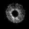

libstarmathpp - A C++ library to process astronomical images based on CImg and range-v3.
===========

## Status of this project
**This project is work in progress. The project is new and therefore there are a lot of changes and for the moment the API cannot be considered as stable.**


## Summary
This project combines the power of the C++ CImg template library (https://cimg.eu/) (which is used
to process images) with the famous range-v3 library from Eric Niebler (https://github.com/ericniebler/range-v3)
to simplify the programatical processing of astronomical images by allowing the construction of intuitive and
easy to understand image processing pipelines.

<br><br><br><br>

## Usage examples

### 1. Calculation of star metrics
In this example all files with extension "*.fit.gz" from directory "my/image/directory" are processed by the pipeline. The processing takes place one by one. Each image is opened and pushed through the processing pipeline. For each image the pipeline suntracts the background, scales the image, performs a centroiding algorithm, again scales down the image, crops the image from the center toa dimension of 61x61 pixels and then calculates the SNR (Signal-to-noise ratio), the HFD (Half-flux diameter) and the FWHM (Full-width half maximum) for each star.

TODO/IDEA: Introduce filter: "has_star" / "has_single_star"...

#### Input images

Star 1  |                                  Star 2                                   |                                 Star 3                                  |                                 Star 4                                  | Star 5
:---------------------------:|:-------------------------------------------------------------------------:|:-----------------------------------------------------------------------:|:-----------------------------------------------------------------------:|:-------------------------:
  |    |  |  | 

#### Code
```cpp
  ...
  
  auto star_metrics =
      | files("my/image/directory", "(.*\\.fit\\.gz)")
      | read()
      | subtract_background(OtsuThresholder<float>(16 /*image bit depth*/))
      | scale_up(3.0F /*scale up factor*/)
      | center_on_star(IntensityWeightedCentroider<float>())
      | scale_down(3.0F /*scale down factor*/)
      | crop_from_center(Size<int>(61,61))
      | ranges::view::transform(
            [](const auto & img_ptr) {
                return std::make_tuple(
                    starmathpp::algorithm::snr(*img_ptr),
                    starmathpp::algorithm::hfd(*img_ptr),
                    starmathpp::algorithm::fwhm(*img_ptr).value()
                );
            })
      | to<std::vector>();


  for (const auto &m : star_metrics) {
      std::cout << std::setprecision(2)
                << "SNR: " << std::get<0>(m)
                << ", HFD: " << std::get<1>(m)
                << ", FWHM: " << std::get<2>(m)
                << std::endl;
  }
	  
  ...
```

#### Output
```bash
SNR: 3.42, HFD: 27.29, FWHM: 7.02
SNR: 4.51, HFD: 21.79, FWHM: 3.26
SNR: 5.92, HFD: 15.90, FWHM: 9.73
SNR: 6.72, HFD: 9.18, FWHM: 4.97
SNR: 4.14, HFD: 3.44, FWHM: 1.85
```

|                                                    Metric                  |                                   Star 1                                   |                                   Star 2                                   |                                   Star 3                                   |                                   Star 4                                   | Star 5
:--------------------------------------------------------------------------:|:--------------------------------------------------------------------------:|:--------------------------------------------------------------------------:|:--------------------------------------------------------------------------:|:--------------------------------------------------------------------------:|:-------------------------:
<B>Result</B>| |  |  |  | 
<B>SNR</B> |                    3.42                    |                                    4.51                                    |                                    5.92                                    |                                    6.72                                    |4.14
<B>HFD</B> |                    27.29                    |                                   21.79                                    |                                   15.90                                    |                                    9.18                                    |3.44
<B>FWHM</B> |                    7.02                    |                                    3.26                                    |                                    9.73                                    |                                    4.97                                    |1.85


<br><br><br><br>


### 2. Image development
This example shows a more or less classical processing pipeline for astronomical images which is often used in astrophotography. To keep it simple the illustrated pipeline only processes the luminance channel an astronomical image (i.e. the input is a grayscale image). Firthermore, please note that in this example no alignment of the frames is performed. The interpolation of bad pixels is optional and not necessarily part of the classical processing flow of astronomial images. It helps to avoid atifacts and division by null / NAN problems. The following image illustrates the processing steps:


The **light frames** are the most important images. They represent the photons which have been collected from the night sky by the CCD sensor through the telescope. In addition, multiple **dark frames** are recorded to measure the noise of the camera. The dark frames are averaged to a **master dark** frame to reduce the noise. This master dark frame is then subtracted from each light frame. In the next step all such light frames where the master dark was subtracted, are averaged to an **average light frame**.

In addition, multiple **flatfield frames** are recorded. To do so the telescope is directed against an evenly distributed white light source. The resulting flatfield frames are then used to correct for variations in the sensitivity of the detector and the optical system. The flatfield frames also contain noise. To reduce the noise **flatfield dark frames** are recorded and then averaged. The resulting **flatfield master dark** frame is then subtracted from each flatfield frame. Finally, the resulting frames are averaged. This is the **average flatfield frame**. In the next step the **average light frame** is divided by this average flatfield frame.

In a last step the final frame is automatically stretched by using a midtone balance algorithm. In this example only the stretched image is stored as 8 bit image to disc. The resulting image can be found further below.


#### Code
```cpp
  ...
  const std::string base_path = "my/raw_image/base_directory/";

  auto dark_files = files(base_path + "dark", "(.*\\.fit\\.gz)") | to<std::vector>();
  auto dark_flat_files = files(base_path + "dark_flat", "(.*\\.fit\\.gz)") | to<std::vector>();
  auto flat_files = files(base_path + "flat", "(.*\\.fit\\.gz)") | to<std::vector>();
  auto light_frame_files = files(base_path + "light", "(.*\\.fit\\.gz)") | to<std::vector>();

  float BAD_PIXEL_THRESHOLD = 500;
  float FILTER_CORE_SIZE = 3;
  float TARGET_BACKGROUND = 0.06F;

  view::single(
      average(
         light_frame_files
         | read()
         | interpolate_bad_pixels(BAD_PIXEL_THRESHOLD, FILTER_CORE_SIZE)
         | subtract(
             average(dark_files
                 | read()
                 | interpolate_bad_pixels(BAD_PIXEL_THRESHOLD, FILTER_CORE_SIZE)
             )
         )
         | divide_by(
             average(
                 flat_files
                 | read()
                 | interpolate_bad_pixels(BAD_PIXEL_THRESHOLD, FILTER_CORE_SIZE)
                 | subtract(
                     average(dark_flat_files
                         | read()
                         | interpolate_bad_pixels(BAD_PIXEL_THRESHOLD, FILTER_CORE_SIZE)
                     )
                 )
             )
          )
      )
  )
  | stretch(starmathpp::algorithm::MidtoneBalanceStretcher(TARGET_BACKGROUND))
  | write<uint8_t>(".", "final_image_%03d.tiff");
		  
  ...
```

#### Output
```bash
...
```


<br><br><br><br>


## build

### Install required dependencies
The following libraries are required to build libstarmathpp on Ubuntu 20.04 LTS or Ubuntu 22.04.
For other Linux distributions the package names may slightly vary.

	sudo apt-get install librange-v3-dev zlib1g-dev cimg-dev libtiff-dev libccfits-dev \
		libboost-dev libboost-regex-dev libboost-thread-dev \
		libboost-test-dev libgoogle-glog-dev libeigen3-dev \
		libceres-dev libunwind-dev libpng-dev libjpeg-dev
						 
### Checkout repository

	git clone https://github.com/carsten0x51h/libstarmath.git


### Configure the build
To build from command line, simply do the following steps:

	cd libstarmathpp
	mkdir build
	cd build
	cmake ..

This will generate the build environment for your operating system. It will fail
if at least one dependency to an external library could not be resolved.

#### Enable X11 display for debug

	cmake .. -DDEBUG_IMAGE_DISPLAY_SWITCH=1


### Build the code
Run the following command to build the project: 

	cmake --build . -- all

or to build parallel on e.g. 12 cores, run

	cmake --build . -j12 -- all

### Run the unit tests

	cmake --build . -- test


### Package / Install
TODO...


## Project structure
The project structure follows the approach presented by Boris Kolpackov: https://www.open-std.org/jtc1/sc22/wg21/docs/papers/2018/p1204r0.html
Also see https://stackoverflow.com/questions/2360734/whats-a-good-directory-structure-for-larger-c-projects-using-makefile

The project mostly follows the C++ coding style guide from Google: https://google.github.io/styleguide/cppguide.html
Formatting rules e.g. for Eclipse CDT can be found here: https://github.com/google/styleguide/blob/gh-pages/eclipse-cpp-google-style.xml


## Further information
Please visit my blog https://www.lost-infinity.com for further details.

